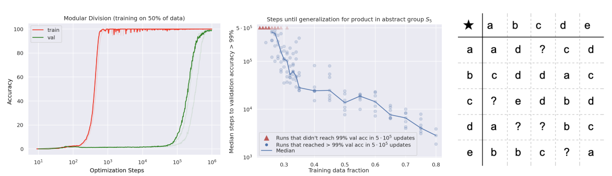
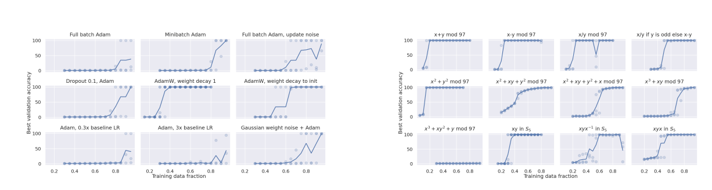
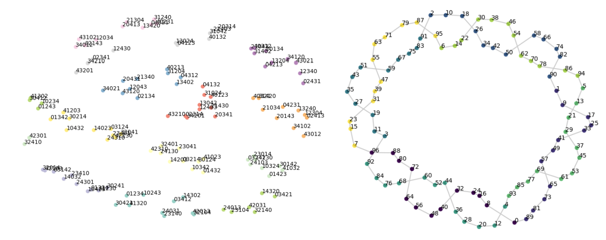
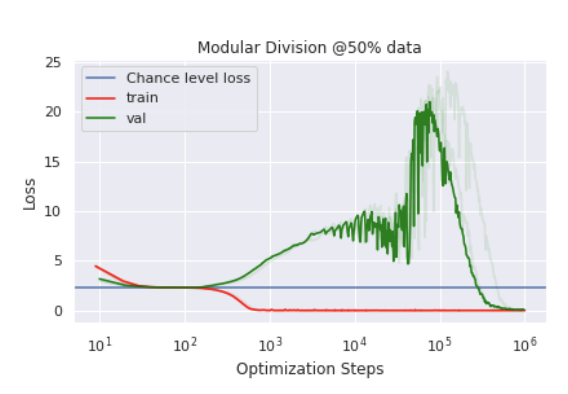

GROKKING: GENERALIZATION BEYOND OVERFITTING ON SMALL ALGORITHMIC DATASETS

Alethea Power, Yuri Burda, Harri Edwards, Igor Babuschkin
OpenAI
Vedant Misra∗
Google

ABSTRACT
In this paper we propose to study generalization of neural networks on small algorithmically generated datasets. In this setting, questions about data efficiency,
memorization, generalization, and speed of learning can be studied in great detail. In some situations we show that neural networks learn through a process
of “grokking” a pattern in the data, improving generalization performance from
random chance level to perfect generalization, and that this improvement in generalization can happen well past the point of overfitting. We also study generalization as
a function of dataset size and find that smaller datasets require increasing amounts
of optimization for generalization. We argue that these datasets provide a fertile
ground for studying a poorly understood aspect of deep learning: generalization
of overparametrized neural networks beyond memorization of the finite training
dataset.

1 INTRODUCTION
The generalization of overparameterized neural networks has long been a source of interest to the
machine learning community since it defies intuitions derived from classical learning theory. In
this paper we show that training networks on small algorithmically generated datasets can reliably
exhibit unusual generalization patterns, clearly decoupled from performance on the training set, in a
significantly more pronounced way than such effects manifest on datasets derived from natural data
(see Figure 1, left, for an example). Such experiments can be quickly reproduced on a single GPU,
and this makes them convenient testbeds for theories of generalization.

Figure 1: Left. Grokking: A dramatic example of generalization far after overfitting on an algorithmic
dataset. We train on the binary operation of division mod 97 with 50% of the data in the training set.
Each of the 97 residues is presented to the network as a separate symbol, similar to the representation
in the figure to the right. The red curves show training accuracy and the green ones show validation
accuracy. Training accuracy becomes close to perfect at < 103 optimization steps, but it takes
close to 106
steps for validation accuracy to reach that level, and we see very little evidence of any
generalization until 105
steps. Center. Training time required to reach 99% validation accuracy
increases rapidly as the training data fraction decreases. Right. An example of a small binary
operation table. We invite the reader to make their guesses as to which elements are missing.
∗Vedant was at OpenAI at the time of this work

The datasets we consider are binary operation tables of the form a ◦ b = c where a, b, c are discrete
symbols with no internal structure, and ◦ is a binary operation. Examples of binary operations include
addition, composition of permutations, and bivariate polynomials. Training a neural network on a
proper subset of all possible equations then amounts to filling in the blanks of the binary op table,
much like solving a Sudoku puzzle. An example is shown on the right in Figure 1. Since we use
distinct abstract symbols for all distinct elements a, b, c involved in the equations, the network is not
made aware of any internal structure of the elements, and has to learn about their properties only
from their interactions with other elements. For example the network doesn’t see numbers in decimal
notation, or permutations in line notation.
Our contributions are as follows:
• We show that neural networks are capable of generalizing to the empty slots in a variety of
binary op tables.
• We show that, long after severely overfitting, validation accuracy sometimes suddenly
begins to increase from chance level toward perfect generalization. We call this phenomenon
‘grokking’. An example is shown in Figure 1.
• We present the data efficiency curves for a variety of binary operations.
• We show empirically that the amount of optimization required for generalization quickly
increases as the dataset size decreases.
• We compare various optimization details to measure their impact on data efficiency. We find
that weight decay is particularly effective at improving generalization on the tasks we study.
• We visualize the symbol embeddings learned by these networks and find that they sometimes
uncover recognizable structure of the mathematical objects represented by the symbols.
2 METHOD
All of our experiments used a small transformer trained on datasets of equations of the form a ◦ b = c,
where each of “a”, “◦”, “b”, “=”, and “c” is a separate token. Details of the operations studied, the
architecture, training hyperparameters and tokenization can be found in Appendix A.1.
3 EXPERIMENTS
3.1 GENERALIZATION BEYOND OVERFITTING
Deep learning practitioners are used to seeing small improvements in validation accuracy after
validation loss stops decreasing. A double descent of validation loss has been documented in
some circumstances, but is considered unusual among practitioners Nakkiran et al. (2019); Belkin
et al. (2018); d’Ascoli et al. (2020). On the small algorithmic datasets that we study, improved
generalization after initial overfitting occurs for a range of models, optimizers, and dataset sizes,
and in some cases these effects are extremely pronounced. A typical example is shown for modular
division in Figure 1. There we see that validation accuracy starts increasing beyond chance level
only after 1000 times more optimization steps than are required for training accuracy to get close to
optimal. In Figure 4 the training/validation losses are also plotted and we see the double descent of
the validation loss.
We found these behaviors to be typical for all the binary operations for dataset sizes that were close
to the minimal dataset size for which the network generalized within the allotted optimization budget.
For larger dataset sizes, the training and validation curves tend to track each other more closely.
3.1.1 LEARNING TIME CURVES
In a typical supervised learning problem, decreasing the amount of training data decreases the
converged generalization performance of the model when the optimization procedure is capable of
interpolating the training data. In our setting, we observe a different phenomenon: while the converged
performance stays constant at 100% within a range of training dataset sizes, the optimization time
required to achieve that performance grows quicky as the dataset size is decreased.

Figure 2: Left. Different optimization algorithms lead to different amounts of generalization within
an optimization budget of 105
steps for the problem of learning the product in the abstract group S5.
Weight decay improves generalization the most, but some generalization happens even with full batch
optimizers and models without weight or activation noise at high percentages of training data. Suboptimal choice hyperparameters severely limit generalization. Not shown: training accuracy reaches
100% after 103
-104 updates for all optimization methods. Right. Best validation accuracy achieved
after 105
steps on a variety of algorithmic datasets, averaged over 3 seeds. Generalization happens at
higher percentages of data for intuitively more complicated and less symmetrical operations.
Figure 1 (center) shows median number of optimization steps until validation performance first
reaches 99% for the product in abstract group S5. In the vicinity of 25-30% of data, a decrease of 1%
of training data leads to an increase of 40-50% in median time to generalization. While the number
of steps until validation accuracy > 99% grows quickly as dataset size decreases, the number of steps
until the train accuracy first reaches 99% generally trends down as dataset size decreases and stays in
the range of 103
-104 optimization steps. We’ve observed a similar pattern of exponential increase in
optimization time until reaching generalization as dataset size decreases on all the algorithmic tasks
for which we could get the networks to generalize.
3.2 GROKKING ON A VARIETY OF PROBLEMS
We’ve measured the mean accuracy across three runs for training datasets consisting of different
fractions of all available equations for a variety of binary operations listed in Appendix A.1.1. The
results are presented in Figure 2 (right).
Since the operands are presented to the neural network as unrelated abstract symbols, the operations
x+y (mod p−1) and x∗y (mod p) with a prime number p and non-zero x, y are indistinguishable
from the neural network’s perspective (and similarly x − y (mod p − 1) and x/y (mod p)). This
is because every nonzero residue modulo a prime can be represented as a power of a primitive root.
This representation shows the equivalence (up to renaming of symbols) of modular addition modulo
p − 1 and modular multiplication modulo p. We see in Figure 2 (right) that x − y and x/y indeed
take about the same amount of data for generalization to occur.
Some of the operations listed in Figure 2 (right) are symmetric with respect to the order of the
operands (x + y, x ∗ y, x
2 + y
2
and x
2 + xy + y
2
). Such operations tend to require less data for
generalization than closely related non-symmetrical counterparts (x − y, x/y, x
2 + xy + y
2 + x).
We believe this effect might be partially architecture-dependent, since it’s easy for a transformer to
learn a symmetric function of the operands by ignoring positional embedding.
Some operations (for example x
3 + xy2 + y (mod 97)) didn’t lead to generalization within the
allowed optimization budget at any percentage of data up to 95%. The converged models effectively
just memorized the training dataset without finding any real patterns in the data. To such a model, the
data is effectively random.
The operation [x/y (mod p) if y is odd, otherwise x − y (mod p)] requires the network to learn a
mix of several simple operations - in particular the role of x has to be interpreted as a residue in the
additive group when it’s paired with an even y, and as a residue in the multiplicative group when it’s
paired with an odd y. This shows that generalization can happen even for operations that are not
cleanly interpretable via group or ring operations.
3.3 ABLATIONS AND TRICKS
We’ve tried various forms of regularization to see what can induce networks to generalize better on
our datasets. Here we present the data efficiency curves on a particular dataset S5 for a variety of
interventions: full-batch gradient descent, stochastic gradient descent, large or small learning rates,
3
residual dropout Srivastava et al. (2014), weight decay Loshchilov & Hutter (2017) and gradient
noise Neelakantan et al. (2015). The results are shown in Figure 2 (left).
We find that adding weight decay has a very large effect on data efficiency, more than halving the
amount of samples needed compared to most other interventions. We found that weight decay towards
the initialization of the network is also effective, but not quite as effective as weight decay towards
the origin. This makes us believe that the prior, that approximately zero weights are suitable for small
algorithmic tasks, explains part, but not all of the superior performance of weight decay. Adding some
noise to the optimization process (e.g. gradient noise from using minibatches, Gaussian noise applied
to weights before or after computing the gradients) is beneficial for generalization, consistent with
the idea that such noise might induce the optimization to find flatter minima that generalize better.
We found that learning rate had to be tuned in a relatively narrow window for the generalization to
happen (within 1 order of magnitude).
3.4 QUALITATIVE VISUALIZATION OF EMBEDDINGS
In order to gain some insight into networks that generalize, we visualized the matrix of the output
layer for the case of modular addition and S5. In Figure 3 we show t-SNE plots of the row vectors.
For some networks we find clear reflections of the structure of the underlying mathematical objects
in the plots. For example the circular topology of modular addition is shown with a ‘number line’
formed by adding 8 to each element. The structure is more apparent in networks that were optimized
with weight decay.
4 DISCUSSION
We have seen that in the datasets we studied, small algorithmic binary operation tables, effects such
as double descent or late generalization, and improvements to generalization from interventions like
weight decay can be striking. This suggests that these datasets could be a good place to investigate
aspects of generalization. For example, we plan to test whether various proposed measures of minima
flatness correlate with generalization in our setting.
We have also seen that visualizing the embedding spaces of these neural networks can show natural
kinds of structure, for example in problems of modular arithmetic the topology of the embeddings
tends to be circles or cylinders. We also see that the network tends to idiosyncratically organize the
embeddings by various residues. Whilst the properties of these mathematical objects are familiar to
us, we speculate that such visualizations could one day be a useful way to gain intuitions about novel
mathematical objects.

Figure 3: Left. t-SNE projection of the output layer weights from a network trained on S5. We see
clusters of permutations, and each cluster is a coset of the subgroup h(0, 3)(1, 4),(1, 2)(3, 4)i or one
of its conjugates. Right. t-SNE projection of the output layer weights from a network trained on
modular addition. The lines show the result of adding 8 to each element. The colors show the residue
of each element modulo 8.
4
In addition, we document an interesting phenomenon, where the number of optimization steps needed
to reach a given level of performance increases quickly as we reduce the size of the training dataset.
Since this represents a way trade compute for performance on smaller amounts of data, it would be
useful to investigate in future work whether the effect is also present for other datasets.

A APPENDIX
A.1 ADDITIONAL EXPERIMENTAL DETAILS
A.1.1 BINARY OPERATIONS
The following are the binary operations that we have tried (for a prime number p = 97):
x ◦ y = x + y (mod p) for 0 ≤ x, y < p
x ◦ y = x − y (mod p) for 0 ≤ x, y < p
x ◦ y = x/y (mod p) for 0 ≤ x < p, 0 < y < p
x ◦ y = [x/y (mod p) if y is odd, otherwise x − y (mod p)] for 0 ≤ x, y < p
x ◦ y = x
2 + y
2
(mod p) for 0 ≤ x, y < p
x ◦ y = x
2 + xy + y
2
(mod p) for 0 ≤ x, y < p
x ◦ y = x
2 + xy + y
2 + x (mod p) for 0 ≤ x, y < p
x ◦ y = x
3 + xy (mod p) for 0 ≤ x, y < p
x ◦ y = x
3 + xy2 + y (mod p) for 0 ≤ x, y < p
x ◦ y = x · y for x, y ∈ S5
x ◦ y = x · y · x
−1
for x, y ∈ S5
x ◦ y = x · y · x for x, y ∈ S5
For each binary operation we constructed a dataset of equations of the form hxihopihyih=ihx ◦ yi,
where hai stands for the token corresponding to element a.
For each training run, we chose a fraction of all available equations at random and declared them to
be the training set, with the rest of equations being the validation set.
A.1.2 MODEL AND OPTIMIZATION
We trained a standard decoder-only transformer Vaswani et al. (2017) with causal attention masking,
and calculated loss and accuracy only on the answer part of the equation. For all experiments we
used a transformer with 2 layers, width 128, and 4 attention heads, with a total of about 4 · 105
non-embedding parameters.
We have tuned optimization hyperparameters by running experiments on modular addition and
product in S5. For final configuration of hyperparameters we have chosen a balance of performance
we saw on S5 and simplicity (for example we chose not to anneal the learning rate for the experiments
in the paper even though it performed better in some situations). For most experiments we used
AdamW optimizer with learning rate 10−3
, weight decay 1, β1 = 0.9, β2 = 0.98, linear learning rate
warmup over the first 10 updates, minibatch size 512 or half of training dataset size (whichever was
smaller) and optimization budget of 105 gradient updates.
In section 3.3 we have also tried the following variants (listed in the reading order for Figure 2 left):
• Adam optimizer with full batch (i.e. exact gradient of the loss on the whole training dataset)
• Adam optimizer
6
• Adam optimizer with full batch and Gaussian noise added to the update direction for each
parameter (W ← W + lr · (∆W + ), where  is sampled from unit Gaussian, ∆W is the
standard Adam weight update, and lr is the learning rate)
• Adam optimizer on model with residual dropout 0.1 added
• AdamW optimizer with weight decay 1 (default setting in most other experiments)
• AdamW optimizer with weight decay 1 towards the initialization instead of the origin
• Adam optimizer with learning rate 3 · 10−4
• Adam optimizer with learning rate 3 · 10−3
• Adam optimizer on model with Gaussian weight noise of standard deviation 0.01 (i.e. each
parameter W replaced by W + 0.01 ·  in the model, with  sampled from unit Gaussian).
For experiments reported in Section 3.1.1 we increased the optimization budget to 5·105 optimization
steps in order to capture the increase of time to perfect generalization better.
For the experiments reported in Section 3.1 we increased the optimization budget to 106
, and used
Adam optimizer with no weight decay, for emphasizing how late into the optimization process the
generalization can begin.
We’ve repeated each experiment for each dataset size with 3 random seeds, with the exception of
experiments in section 3.1.1, where we’ve aggregated results over 7 random seeds.
A.2 ADDITIONAL FIGURES

In Figure 4 we show the loss curves that correspond to the accuracy curves in Figure 1.
In Figure 5 we show an example of a binary operation table that the network can actually solve.
Figure 4: The loss curves for modular division, train and validation. We see the validation loss
increases from 102
to about 105 optimization steps before it begins a second descent.
A.3 RELATED WORK
In this paper we study training and generalization dynamics on small simple algorithmic datasets. In
the past, algorithmic datasets have been used to probe the capability of neural networks to perform
symbolic and algorithmic reasoning. For example the tasks of copying, reversing, and sorting
randomly generated sequences, and performing arithmetic operations of multi-digit numbers, have
been used as standard benchmarks for sequence-to-sequence models Graves et al. (2014), Weston
et al. (2014) Kaiser & Sutskever (2015) Reed & De Freitas (2015), Grefenstette et al. (2015), Zaremba
& Sutskever (2015), Graves (2016), Dehghani et al. (2018). Typically in these works however the
emphasis is on the performance in the unlimited data regime, with generalization often studied with
respect to input sequence length. Some papers study the sample complexity on algorithmic tasks
Reed & De Freitas (2015), but mostly focus on the impact of architectural choices. In contrast we
study the phenomenon of generalization in data-limited regime, with an emphasis on phenomena that
we believe to be architecture-agnostic.
7
Figure 5: One of the binary operation tables presented to the networks that the network can perfectly
fill in. Each symbol is represented as a letter in English, Hebrew, or Greek alphabet for reader’s
convenience. We invite the reader to guess which operation is represented here.
Algorithmically generated reasoning datasets like bAbI Weston et al. (2015) encourage work on
studying generalization in data-limited regime. Most results on such datasets however focus on a
point estimate of performance of a particular architecture or training technique, whereas our main
interest is in pointing out the change in generalization past the point where a particular architecture
can memorize the training data completely.
Neelakantan et al. (2015) has a “grok-like” learning curve on an algorithmic task, but it is related to
optimization difficulty, whereas our phenomenon is specifically about generalization.
In Saxton et al. (2019) they study generalization on procedurally generated math problems such as
arithmetic and differentiation, but for the most part these tasks are more involved than the simple
binary op problems we have studied and as such do not lend themselves to observing the kinds of
phenomena we describe in this paper, since they would require an extremely large number of samples
to master.
In Jiang et al. (2019) they studied a large number of generalization or complexity measures on
convolutional neural networks to see which, if any, are predictive of generalization performance.
They find that flatness based measures that aim to quantify the sensitivity of the trained neural network
to parameter perturbations are the most predictive. We conjectured that the grokking phenomena
8
we report in this work may be due to the noise from SGD driving the optimization to flatter/simpler
solutions that generalize better and hope to investigate in future work whether any of these measures
are predictive of grokking.
Zhang et al. (2016) finds that neural networks of sizes typically used in deep learning can interpolate
arbitrary training data, and yet generalize when trained with semantically meaningful labels using
appropriate optimization procedures. Our work shows a related phenomenon where neural networks
can interpolate a small algorithmic training dataset without generalizing, but start generalizing when
trained with SGD for longer.
Nakkiran et al. (2019); Belkin et al. (2018) focus on the phenomenon of double descent in loss as
a function of model and optimization procedure capacity. They find that the classical U-shaped
validation loss curve is followed in some settings (including neural network training) by a second
descent of loss that starts around the minimal capacity that is needed to interpolate any training data.
We observe a second descent in validation loss (though not accuracy) as a function of the amount of
training in some of our experiments, and it happens past the point of interpolating the training data.
We believe that the phenomenon we describe might be distinct from the double descent phenomena
described in Nakkiran et al. (2019); Belkin et al. (2018) because we observe the second descent
in loss far past the first time the training loss becomes very small (tens of thousands of epochs in
some of our experiments), and we don’t observe a non-monotonic behavior of accuracy. The setting
of small algorithmic datasets that we study also provides a smaller, more tractable playground for
studying subtle generalization phenomena than natural datasets studied in Nakkiran et al. (2019).
A.4 GENERALIZATION WITH MEMORIZING SEVERAL OUTLIERS
Figure 6: Effect on data efficiency of introducing k ∈ [0, 10, 100, 1000, 2000, 3000] outliers (examples with random labels) into the training data. Small number of outliers doesn’t noticeably impact
generalization performance, but a large number hinders it significantly.
In this section we show data efficiency curves for a modified version of a binary op by introducing
k outliers to the training dataset. More precisely, at the beginning of the experiment we randomly
sample k equations from the training set and replace their answers with answers to other k equations
randomly sampled from the training data. The rest of the equations in the training data and all the
equations in the validation data are kept as before.
In this situation one could imagine one of the following scenarios unfolding. If the model class of
neural networks optimized and regularized as before was not large enough to interpolate such “noisy”
dataset, one could imagine the procedure converging to a solution that generalizes well, but denoises
the training data (i.e. predicts c = a ◦ b as an answer even for the outlier equations a, b → c
0 with
c
0 6= c). On the other extreme it could be that the optimization procedure can find networks that
interpolate the data, but the resulting models don’t generalize, because they are forced to represent a
considerably more complicated function than before (a simple function + k exceptions encoded in
the training data).
In our experiments we find that the first option doesn’t happen - all experiments reach 100% training
accuracy at some point, and this point is not considerably affected by changing the number of outliers
k. The second phenomenon happens in a range of training data percentages and number of outliers k
- increasing k decreases the range of training data percentages for which the optimization procedure
converges to models that generalize. However the effect of introducing a small number of outliers
(up to 1000) is not very pronounced - see Figure 6. We interpret this as additional evidence that
the capacity of the network and optimization procedure is well beyond the capacity needed for
9
memorizing all the labels on the training data, and that generalization happening at all requires a
non-trivial explanation.
A.5 GENERALIZATION MEASURES
We believe it is useful to explore how predictive common generalization measures are of generalization
on small algorithmic datasets presented in this paper. In a preliminary investigation we found that
sharpness Hochreiter & Schmidhuber (1997) of the minimum found by a trained network measure
seems to be predictive of generalization on one of these datasets. We trained multiple networks
with different initialization seeds for a fixed number a steps on the S5 composition objective, until
approximately half of them achieved high validation accuracy. We then used the method described in
Keskar et al. (2016) to calculate the sharpness approximation value, φ. We found that the validation
accuracy and the φ score across our trained networks had Spearman correlation coefficient of
−0.79548 (significant with p < 0.000014). This is suggestive that grokking may only happen after
the network’s parameters are in flatter regions of the loss landscape. It would be valuable for future
work to explore this hypothesis, as well as test other generalization measures.
Figure 7: Networks trained on the S5 composition objective appear to only grok in relatively flat
regions of the loss landscape.
10