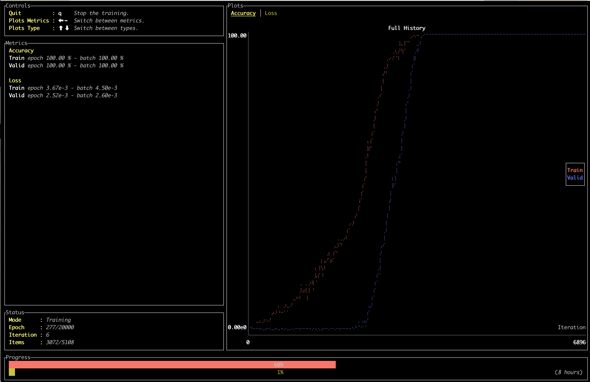
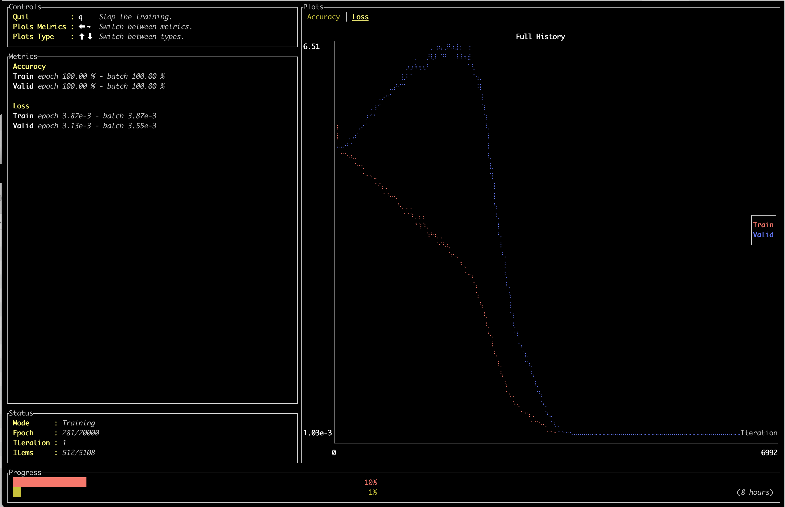

# Grokking (Burn)

This project reproduces the grokking modular addition experiment in Rust using the Burn framework.





## Run Training (TUI)

The training loop uses Burn's `SupervisedTraining` with the default renderer. The renderer is a TUI
when the `tui` feature is enabled and stdout is a terminal; otherwise it falls back to a CLI
renderer.

1) Enable the TUI feature in `Cargo.toml`:

```toml
burn = { version = "0.20.0-pre.6", default-features = false, features = ["std", "tui", "train", "wgpu", "autodiff"] }
```

2) Run training:

```bash
cargo run --release --bin grokking
```

If you don't enable the `tui` feature, the run will still work and log metrics to the console.

## Outputs

- Metrics logs: `artifacts/train/` and `artifacts/valid/`
- Checkpoints: `artifacts/checkpoint/`
- Labeled checkpoints: `artifacts/checkpoint_labeled/`
- Metrics snapshots: `artifacts/loss_history.json`, `artifacts/accuracy_history.json`
- FFT analysis: `artifacts/fft_analysis.json`

## Figures and Embeddings

```bash
cargo run --release --bin generate_figures
cargo run --release --bin visualize_embeddings
```
