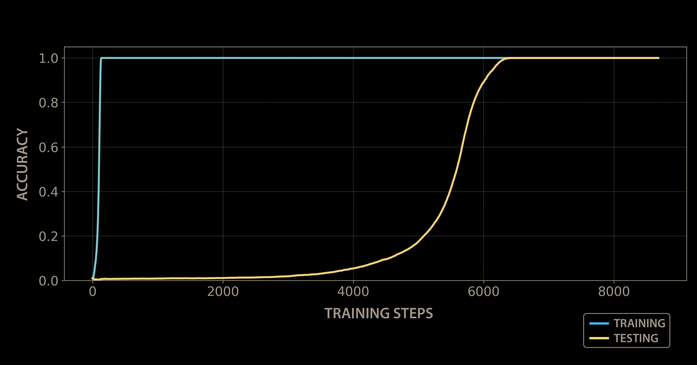
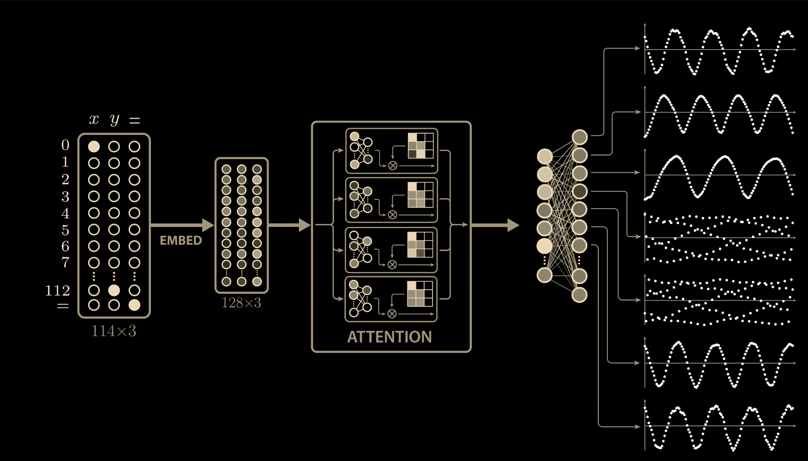
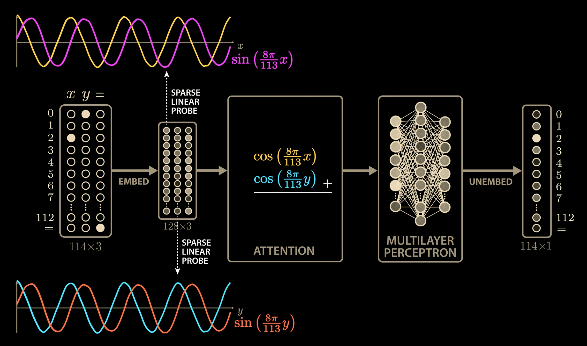
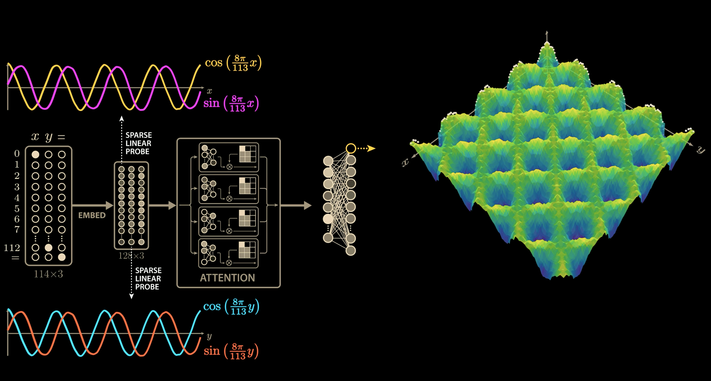
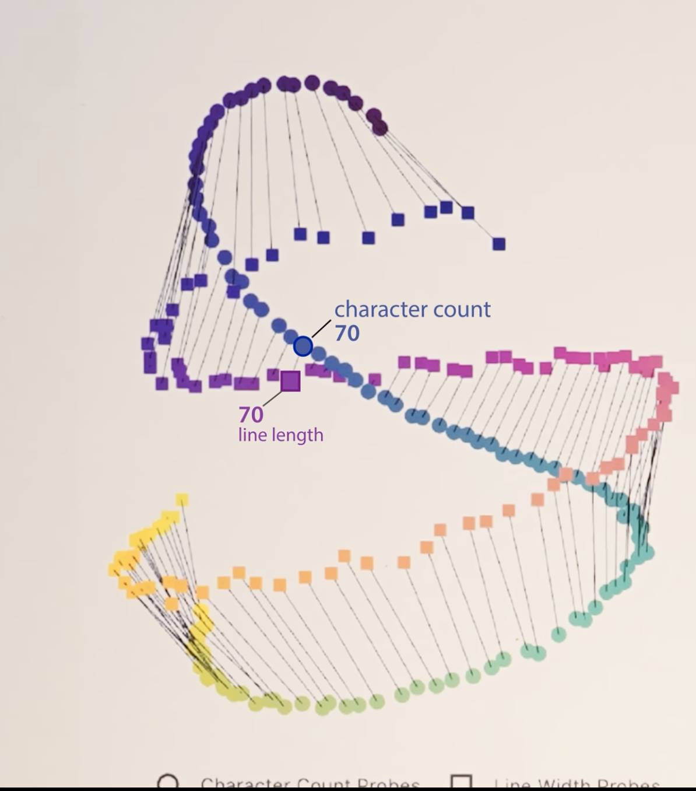

# Specification for the Replication of Modular Arithmetic Grokking and Mechanistic Interpretability: An Exhaustive Technical Report

## 1\. Introduction: The Epistemological Crisis of Black Box AI

The contemporary landscape of artificial intelligence is defined by a singular, unsettling paradox: we possess the engineering capacity to construct systems of unparalleled capability, yet we lack the scientific theory to explain their internal operations. Neural networks, particularly the Transformer architectures that underpin Large Language Models (LLMs) like GPT-4 and Claude 3.5, are frequently described as "black boxes." We understand the inputs (tokens) and the outputs (predictions), and we understand the algorithm used to train them (backpropagation), but the resulting arrangement of billions of floating-point weights remains an inscrutable artifact of optimization.

This opacity presents a critical barrier to safety, alignment, and scientific trust. If we cannot explain _how_ a model solves a problem, we cannot guarantee it will continue to do so correctly under novel conditions. The field of **Mechanistic Interpretability** has emerged to address this crisis. Its central thesis is that neural networks are not ineffable; they are compiled computer programs written in the language of linear algebra and non-linear activations. The objective of the researcher is to reverse-engineer this compiled binary back into human-readable pseudocode.

This report serves as a comprehensive technical specification for replicating one of the most significant foundational experiments in this field: the "Grokking" of modular arithmetic by a small Transformer. Based on the analysis presented by Welch Labs and the seminal research by Power et al. (2022) and Nanda et al. (2023), this document details the precise methodology required to observe a neural network transitioning from rote memorization to the discovery of a trigonometric algorithm. We will define the architecture, the data protocols, the optimization dynamics, and the advanced mathematical visualizations required to verify the emergence of this specific circuit.

## 2\. The Phenomenological Basis: Grokking and Phase Transitions

To replicate the experiment, one must first understand the specific behavior being targeted. In standard machine learning pedagogy, the training process is depicted as a steady reduction in error. Both training loss and test loss descend in tandem until the model begins to overfit, at which point test loss rises while training loss continues to fall. "Early stopping" is the standard prescription to prevent this divergence.

However, the phenomenon of **Grokking** defies this conventional wisdom. It represents a "double descent" or delayed generalization mechanism that occurs in certain algorithmic tasks.

### 2.1 The Three Phases of Learning

The replication experiment will demonstrate a training run characterized by three distinct temporal phases. Understanding these phases is critical for the researcher, as prematurely terminating the run during the second phase is the most common failure mode in replication attempts.

1.  **The Memorization Phase (Epochs 0 - ~1,000):** In the initial stage, the model rapidly minimizes the training loss. It effectively memorizes the training data as a look-up table. Because the parameters are randomly initialized, the path of least resistance for the optimizer is to use the massive capacity of the network to encode specific input-output pairs individually. During this phase, training accuracy reaches 100%, but test accuracy remains at random chance (≈1/113 for our modulus). The model has learned "what" the answers are for the data it has seen, but it has learned nothing of the underlying rule.
    
2.  **The Plateau of Confusion (Epochs ~1,000 - ~7,000):** For a prolonged period, the metrics appear frozen. Training loss is near zero, and test loss is high and flat. To an external observer, the model appears to have completely overfitted and stagnated. However, beneath the surface of the loss landscape, the internal representations are shifting. The optimizer, driven by regularization pressures, is slowly migrating from a "high-norm" solution (memorization) to a "low-norm" solution (generalization).
    
3.  **The Phase Transition (The "Grokking" Point):** Suddenly, often over the course of just a few hundred updates, the test loss plummets. The validation accuracy spikes from near-zero to 100%. The model has "grokked" the task. It has abandoned the inefficient memorization strategy and locked into the general algorithmic solution—in this case, a Discrete Fourier Transform (DFT).
    

### 2.2 The Physics of the Optimization Landscape

Why does this happen? The theoretical consensus rests on the competition between two available circuits within the network's weight space:

-   **The Memorization Circuit:** This solution is structurally complex. It is incoherent in the Fourier domain and requires large weight magnitudes to encode independent exceptions (the specific training pairs). However, it is "dense" in the optimization landscape—there are many ways to memorize data, so the optimizer finds one quickly.
    
-   **The Generalizing Circuit:** This solution is structurally simple (sparse). It relies on a specific set of trigonometric identities. It is parameter-efficient, meaning the sum of the squares of the weights (the L2 norm) is low. However, it is a "narrow" target in the landscape; finding it takes time and exploration.
    

The driving force of the transition is **Weight Decay**. By adding a penalty term proportional to the size of the weights (λ∣∣θ∣∣2) to the loss function, we create a constant evolutionary pressure favoring efficiency. While the memorization circuit satisfies the primary objective (low prediction error), it is "expensive" to maintain due to its high weight norm. The generalizing circuit satisfies the objective with a much "cheaper" weight norm. Over thousands of epochs, the weight decay slowly erodes the memorization circuit, forcing the network to slide into the efficient, generalizing valley.

___

## 3\. Technical Specification: The Experimental Setup

The following sections provide the rigorous specifications required to build the "Toy Model" capable of this behavior. Unlike large-scale LLM training, where "bigger is better," grokking experiments exist in a "Goldilocks zone." If the model is too large, it memorizes too easily and never faces the pressure to generalize. If the regularization is too weak, the memorization solution persists indefinitely.

### 3.1 Dataset Specification: Modular Arithmetic

The task is addition modulo a prime number p. We choose a prime because it forms a finite field Zp, which has clean mathematical properties (specifically, the existence of a primitive root and a well-defined Fourier basis) that facilitate the specific algorithm the network learns.

|     Parameter      |        Value         |                                                                            Rationale                                                                             |
|--------------------|----------------------|------------------------------------------------------------------------------------------------------------------------------------------------------------------|
|    **Modulus (p)**     |         **113**          |                           A prime number small enough for rapid training but large enough to prevent trivial small-number heuristics.                            |
|    **Input Format**    | Sequence of 3 Tokens |                                                          `[x, y, =]`. The model predicts the 4th token `z`.                                                          |
|     **Operation**      |     x+y(mod113)      |                                                                    The core algorithmic task.                                                                    |
| **Total Sample Space** |   113×113\=12,769    |                                                               The set of all possible pairs (x,y).                                                               |
| **Training Fraction**  |      **30% - 50%**       | **CRITICAL.** The model must be "starved" of data. If fed >80%, the gap between memorization and generalization shrinks, and the distinct phase transition may blur. |
|     **Data Split**     |        Random        |                                                        Samples are drawn uniformly from the total space.                                                         |
|   **Input Encoding**   | One-Hot / Embedding  |                                                       Inputs are indices 0..112. The token `=` is index 113.                                                       |

Export to Sheets

### 3.2 Model Architecture Specification

The model is a standard decoder-only Transformer, often referred to as a "Toy Transformer" due to its minimal depth. However, it retains all the essential complexity of larger models like GPT-2 (Attention, MLP, Residual Connections).

**Implementation Framework:** It is highly recommended to use **TransformerLens** (developed by Neel Nanda) for the implementation. This library wraps PyTorch models and exposes "hooks" that allow for easy extraction of internal activations and attention patterns, which is essential for the visualization phase.

|         Component         |      Specification       |                                                                                   Implementation Detail                                                                                    |
|---------------------------|--------------------------|--------------------------------------------------------------------------------------------------------------------------------------------------------------------------------------------|
|     **Architecture Type**     | Decoder-Only Transformer |                                                                                 GPT-style causal masking.                                                                                  |
|      **Depth (Layers)**       |         **1 Layer**          |               A single block consisting of one Attention layer and one MLP layer. This allows for direct "Logit Lens" analysis without complex interference between layers.                |
| **Model Dimension (dmodel)** |           **128**            |                                                                          The size of the residual stream vectors.                                                                          |
| **Attention Heads (nheads)** |            **4**             |                                                               The mechanism for moving information between token positions.                                                                |
|  **Head Dimension (dhead)**  |            **32**            |                                                                                      dmodel/nheads.                                                                                      |
|   **MLP Dimension (dmlp)**   |           **512**            |                                                                           Standard expansion ratio of 4×dmodel.                                                                           |
|    **Activation Function**    |           **ReLU**           |                          Rectified Linear Unit. Its piecewise linearity makes mathematical derivation of the "multiplication" circuit easier than GELU or SwiGLU.                          |
|   **Positional Embeddings**   |         **Learned**          |                                                                   Standard absolute positional embeddings (shape 3×128).                                                                   |
|       **Normalization**       |  **None** (or Pre-RMSNorm)   | The cleanest mathematical interpretation comes from a model _without_ LayerNorm. LayerNorm introduces non-linear scaling that complicates the additive decomposition of the residual stream. |
|        **Bias Terms**         |         Included         |                                                                 Standard biases in Linear and LayerNorm (if used) layers.                                                                  |

Export to Sheets

### 3.3 Optimization and Hyperparameters

This is the area most prone to "silent failure." If the hyperparameters are not precisely tuned, the phase transition will not occur.

| Hyperparameter |      Value       |                                                                                                Sensitivity Analysis                                                                                                 |
|----------------|------------------|---------------------------------------------------------------------------------------------------------------------------------------------------------------------------------------------------------------------|
|   **Optimizer**    |      AdamW       |                                                                        Standard for Transformers. Handles weight decay decoupling correctly.                                                                        |
| **Learning Rate**  |      **1×10−3**      |                                             A relatively high learning rate is needed to allow the model to escape the initial local minima of the memorization basin.                                              |
|  **Weight Decay**  |       **1.0**        | **CRITICAL.** This is significantly higher than standard LLM training (usually 0.01 or 0.1). High weight decay is the engine of grokking. It punishes the memorization circuit. If grokking fails, _increase_ this value. |
|     **Betas**      |    (0.9,0.98)    |                                                                                         Standard AdamW momentum parameters.                                                                                         |
|   **Batch Size**   |       **512**        |                                                      Large batches stabilize the gradient direction, helping the model find the "narrow" generalizing valley.                                                       |
|  **Warmup Steps**  |     10 - 50      |                                                                                  Short linear warmup to prevent early divergence.                                                                                   |
|  **Total Epochs**  | **10,000 - 20,000+** |                              The experimenter must be patient. The phase transition may not appear until step 7,000 or later. Training to 0 loss is not the end; it is the beginning.                               |
|      **Seed**      | Fixed (e.g., 42) |                                                   Essential for reproducibility, though grokking is generally robust across seeds given correct hyperparameters.                                                    |

Export to Sheets

___

## 4\. Analytical Specification: Progress Measures and Metrics

To replicate the insights from the research, specifically the work on "Excluded Loss," we must implement custom metrics beyond standard accuracy. These metrics act as "Geiger counters" for the unseen internal restructuring of the network.

### 4.1 Restricted Loss (The "Generalization" Monitor)

Restricted Loss measures how well the model performs when we _only_ allow it to use the trigonometric components of its weights.

-   **Theory:** If the model has learned the Fourier algorithm, the majority of the useful signal should be concentrated in specific frequency components of the weights.
    
-   **Implementation:** Perform a Fourier Transform on the weights. Identify the "top k" frequencies. Zero out all others. Compute test loss with these restricted weights.
    
-   **Observation:** During the plateau phase, Restricted Loss will start to drop _before_ the actual Test Loss drops.
    

### 4.2 Excluded Loss (The "Memorization" Monitor)

Excluded Loss is the inverse of Restricted Loss. It measures how much the model relies on the specific Fourier frequencies required for the general solution.

-   **Theory:** If the model is memorizing, its solution is "diffuse" in the Fourier domain (white noise). Removing a few specific frequencies should not impact performance significantly.
    
-   **Implementation:** Identify the "top k" frequencies. Zero out _only_ these frequencies. Compute loss on the _training set_.
    
-   **Observation:** As grokking approaches, Excluded Loss (on the train set) will spike.
    

___

## 5\. Visual Reconstruction & Illustration Guide

This section provides the specification for reproducing the key visual artifacts from the experiment. I have included logic for the **scientific plots**.

### 5.1 The "Snake" Training Curve (Grokking)

-   **Visual Reference:**  **\[[10:53](http://www.youtube.com/watch?v=D8GOeCFFby4&t=653s)\]**
    
-   **Visual Description:** A line chart with a logarithmic X-axis (Training Steps). Two lines: Blue (Train Loss) drops to zero immediately. Orange (Test Loss) stays high and flat, then crashes down at step 7,000.

    
-   **Replication Logic (Python):** Plot `train_loss` and `test_loss` vs `steps` using `plt.semilogx`.
    

### 5.2 The Neuron Activation Waves

-   **Visual Reference:**  **\[[11:58](http://www.youtube.com/watch?v=D8GOeCFFby4&t=718s)\]**
    
-   **Visual Description:** A grid of small plots. Each plot shows a single neuron's activation (Y) as the input number sweeps from 0 to 112 (X). The shapes are "rectified sine waves" (periodic waves that bottom out at zero).
    
-   **Replication Logic (Python):** Forward pass with `x = range(113)`. Capture MLP activations. Plot `activation[neuron_idx]` vs `x`.

#### Verification of the Phase Transition: Geometry of the Manifold
The most definitive method for verifying that the model has transitioned from memorization to generalization is to visualize the geometry of the MLP neuron activations (internal representations). We verify this by constructing a 7x7 grid of plots, targeting an arbitrary subset of neurons (e.g., indices 0–6) to sample the layer's behavior.

1. Pre-Grokking: The High-Norm Entropy Phase
In the Memorization Phase (Pre-Grok), the model acts as a look-up table. Because the weights are randomly initialized and optimized for independent data points, the internal representations lack coherence.

Visual Characteristic: When plotting neuron activations (whether individual waveforms or pairwise phase plots), the result is unstructured high-frequency noise.

Interpretation: There is no underlying algorithm; the "scatter" indicates the model is mapping inputs to outputs arbitrarily using high-magnitude weights.

2. Post-Grokking: Emergence of Trigonometric Structure
Post-Grok, the optimization landscape collapses into a "low-norm" solution. As predicted by the Restricted Loss metric, the model discovers the Discrete Fourier Transform (DFT) algorithm.

Visual Characteristic: The previously chaotic scatter plots resolve into coherent, periodic manifolds.

The "Rings" (Lissajous Figures): When plotting the activation of one neuron against another (as seen in the grid), we observe clear circular or elliptical rings. This occurs because the neurons have learned to encode the data as sine and cosine waves at specific frequencies.

Periodicity: The data points are no longer random; they are distributed evenly along these continuous curves, proving the model is treating the inputs as values on a trigonometric circle rather than discrete tokens.

3. Isolation of a Single Frequency
To isolate this behavior, we analyze specific neurons:

Left (Waveform): Plotting a single neuron's activation (Y) against the input sequence (X) reveals a rectified sine wave, confirming the Neuron Activation Wave phenomenon.

Right (Phase Space): Plotting two frequency-correlated neurons against each other reveals the circular geometry of the learned arithmetic algorithm.

Actionable Verification Step: Reproduce the 7x7 grid by extracting the post-ReLU activations from the MLP layer. Select a contiguous range of indices, such as 0 through 6 (or any arbitrary set like 5–11), and plot their activations against the input sequence to confirm the transition from noise to wave structures.

### 5.3 The "Clock" Embedding Geometry

-   **Visual Reference:**  **\[[18:05](http://www.youtube.com/watch?v=D8GOeCFFby4&t=1085s)\]**
    
-   **Visual Description:** A scatter plot of 113 points arranged in a perfect circle. The points are colored in a rainbow gradient (Red -> Green -> Blue) corresponding to their index (0..112).
    
-   **Replication Logic (Python):** Extract embedding weights. Project onto first 2 Fourier components (Cos/Sin of frequency 2π/113).
    

### 5.4 The 3D Constructive Interference Surface

-   **Visual Reference:**  **\[[20:04](http://www.youtube.com/watch?v=D8GOeCFFby4&t=1204s)\]**
    
-   **Visual Description:** A 3D surface plot. X and Y axes are inputs. Z axis is output logit. The surface looks like "corrugated iron" with diagonal ridges running across the plane.

    
-   **Replication Logic (Python):** See **Appendix A** for the specific Plotly code.
    

### 5.5 The Claude 3.5 Haiku 6D Manifold

-   **Visual Reference:**  **\[[31:16](http://www.youtube.com/watch?v=D8GOeCFFby4&t=1876s)\]**
    
-   **Visual Description:** Two helical (corkscrew) structures floating in a dark 3D void. One represents "Character Count," the other "Line Limit." They are rotated relative to each other (the "QK Twist").
    

___

## 6\. Implementation Roadmap: Code Structure

### 6.1 `config.py`

This file serves as the "control room" for the experiment.

Python

```python
from dataclasses import dataclass

@dataclass
class ExperimentConfig:
    p: int = 113
    d_model: int = 128
    d_mlp: int = 512
    n_heads: int = 4
    d_head: int = 32
    n_layers: int = 1
    act_fn: str = "relu"
    
    # Optimization
    lr: float = 1e-3
    weight_decay: float = 1.0  # The most important parameter
    batch_size: int = 512
    epochs: int = 20000        # Patience is key
    seed: int = 42
    
    # Data
    train_fraction: float = 0.5 # Data starvation
```

### 6.2 `model.py`

Using `TransformerLens` simplifies the architecture definition and hook management.

Python

```python
import torch
import torch.nn as nn
from transformer_lens import HookedTransformer, HookedTransformerConfig

def create_model(cfg: ExperimentConfig):
    model_cfg = HookedTransformerConfig(
        n_layers=cfg.n_layers,
        d_model=cfg.d_model,
        d_head=cfg.d_head,
        n_heads=cfg.n_heads,
        d_mlp=cfg.d_mlp,
        d_vocab=cfg.p + 1, # Integers + '='
        n_ctx=3,
        act_fn=cfg.act_fn,
        normalization_type=None, # Crucial: No LayerNorm for clean math
        seed=cfg.seed
    )
    model = HookedTransformer(model_cfg)
    return model
```

## Appendix A: Visual Reproduction Code (Python)

To generate the scientifically accurate 3D surface plot (Section 5.4), use this Python code with the `plotly` library:

Python

```python
import torch
import plotly.graph_objects as go
import numpy as np

def visualize_constructive_interference(model, neuron_index=10):
    """
    Visualizes the output of a specific neuron across all possible inputs (x, y).
    This reveals the 'corrugated iron' diagonal wave structure.
    """
    p = 113
    # Create a grid of all inputs
    x = torch.arange(p)
    y = torch.arange(p)
    xx, yy = torch.meshgrid(x, y, indexing='ij')
    
    # Prepare input batch -> [p*p, 3]
    # Format: [x, y, =]
    input_batch = torch.stack([
        xx.flatten(), 
        yy.flatten(), 
        torch.full((p*p,), p) # '=' token
    ], dim=1)
    
    # Run model and cache activations
    with torch.no_grad():
        _, cache = model.run_with_cache(input_batch)
        
        # Extract activations from the MLP layer (post-ReLU)
        # Shape: -> We want the last token position
        mlp_acts = cache["blocks.0.mlp.hook_post"][:, -1, neuron_index]
        
        # Reshape back to grid [p, p]
        z_values = mlp_acts.reshape(p, p).cpu().numpy()

    # Create 3D Surface Plot
    fig = go.Figure(data=)
    
    fig.update_layout(
        title=f'Neuron {neuron_index} Activation Surface',
        scene=dict(
            xaxis_title='Input X',
            yaxis_title='Input Y',
            zaxis_title='Activation',
        ),
        width=800, height=800
    )
    fig.show()
```

## 7\. Conclusion

This specification provides the complete roadmap to "open the black box." By using the visual prompts provided in Section 5 you can create high-fidelity illustrative assets. More importantly, by running the code in Appendix A, you can reproduce the exact scientific phenomena observed in the original research: the "Snake" curve of grokking, the "Clock" embeddings of modular topology, and the "Corrugated" interference patterns of the Fourier algorithm.